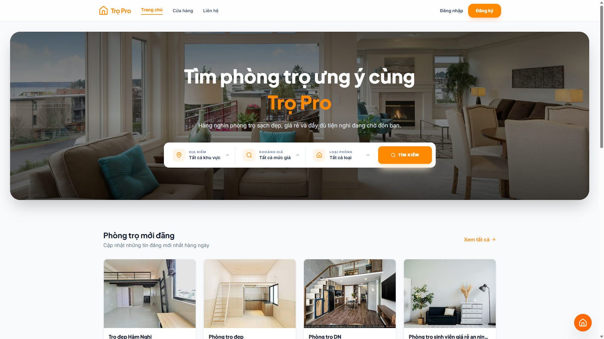
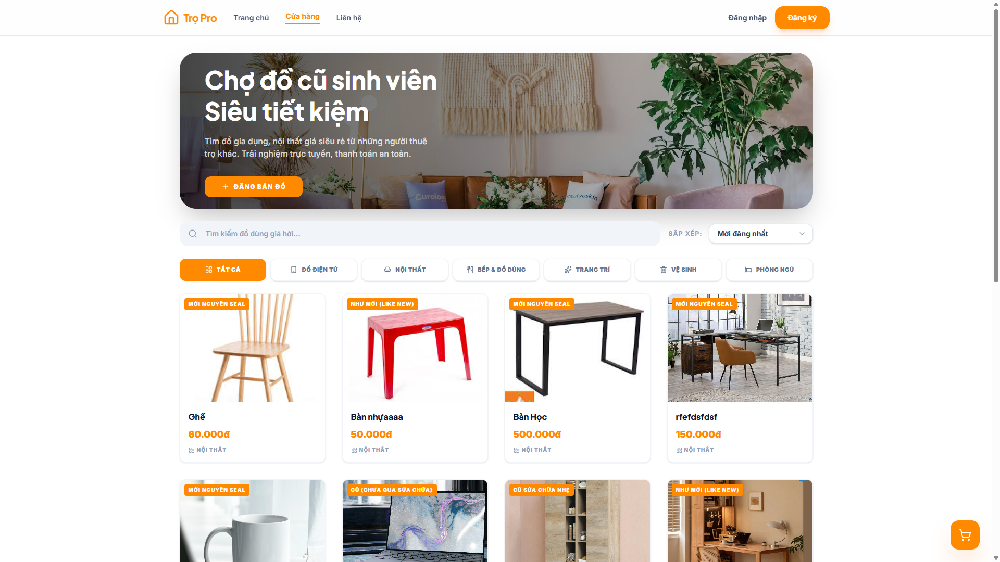
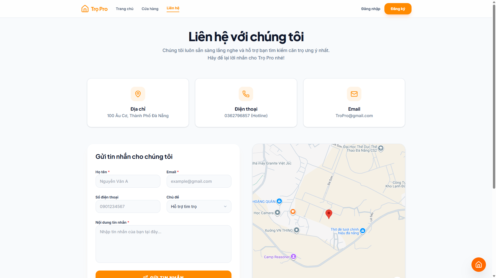
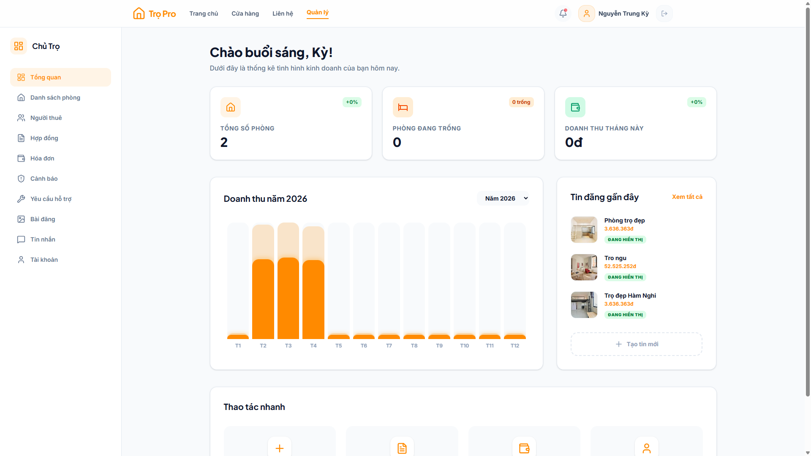
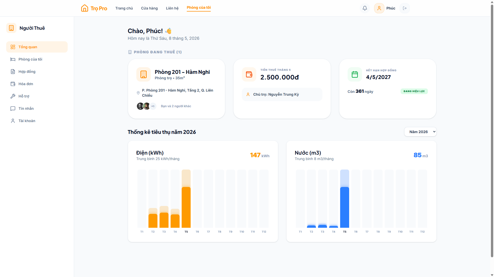
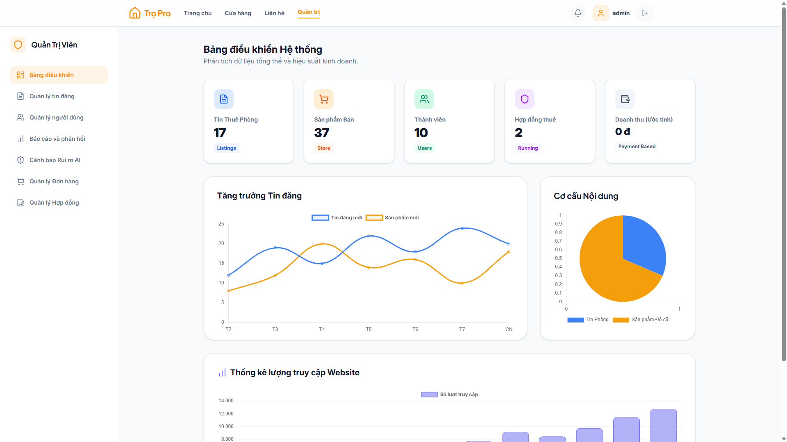

# 🏠 Trọ Pro (TroPro) - Nền tảng Quản lý và Cho thuê Phòng trọ thông minh tích hợp AI


## 📋 Giới thiệu dự án
**Trọ Pro** là một hệ sinh thái chuyển đổi số hiện đại dành cho thị trường bất động sản cho thuê (phòng trọ, căn hộ). Dự án không chỉ dừng lại ở việc kết nối giữa **Chủ trọ** và **Người thuê**, mà còn tiên phong ứng dụng công nghệ **AI (Artificial Intelligence)** để phân tích rủi ro sử dụng điện nước, tự động hóa quy trình thanh toán và nâng cao trải nghiệm sống của người dùng.

---

## 📸 Giao diện ứng dụng

| Trang chủ & Tìm kiếm | Chợ đồ cũ Sinh viên | Liên hệ & Bản đồ |
| :---: | :---: | :---: |
|  |  |  |
| **Dashboard Chủ trọ** | **Dashboard Người thuê** | **Quản trị hệ thống** |
|  |  |  |

---

## ✨ Các tính năng nổi bật

### 🚀 Hệ thống Thuê phòng (Rental Marketplace)
- **Bản đồ tương tác (Google Maps API):** Tìm kiếm và xem vị trí phòng trọ trực quan trên nền tảng bản đồ Google Maps hiện đại.
- **Bộ lọc thông minh:** Lọc phòng theo giá, diện tích, tiện nghi và khu vực.
- **Quản lý Hợp đồng:** Lưu trữ và quản lý trạng thái hợp đồng thuê phòng minh bạch.

### 🛒 Chợ đồ cũ Sinh viên (Second-hand Marketplace)
- **Sàn giao dịch nội bộ:** Nơi người thuê có thể đăng bán các vật dụng gia dụng, nội thất đã qua sử dụng.
- **Quản lý Sản phẩm:** Hỗ trợ đăng tin với hình ảnh, mô tả tình trạng (Mới, Like New, Cũ) và phân loại danh mục.
- **Quy trình Đặt hàng:** Tích hợp giỏ hàng, quản lý đơn hàng và theo dõi trạng thái vận chuyển.
- **Thanh toán linh hoạt:** Hỗ trợ cả thanh toán trực tuyến qua VNPay và COD.

### 🤖 Công nghệ AI Đột phá
- **Phân tích Rủi ro Năng lượng:** Sử dụng **Google Gemini AI** để phân tích dữ liệu điện, nước, phát hiện các bất thường hoặc lãng phí.
- **ProBot Chat:** Trợ lý ảo AI hỗ trợ giải đáp thắc mắc và hướng dẫn sử dụng 24/7.

### 💼 Quản lý Chuyên nghiệp (Dashboards)
- **Chủ trọ (Landlord):** Quản lý danh sách phòng, tin đăng, hóa đơn và yêu cầu hỗ trợ.
- **Người thuê (Tenant):** Theo dõi chỉ số điện nước, thanh toán hóa đơn trực tuyến.
- **Quản trị viên (Admin):** Kiểm duyệt tin đăng phòng và sản phẩm chợ đồ cũ trên toàn hệ thống.

---

## 🛠️ Công nghệ sử dụng (Tech Stack)

| Lớp | Công nghệ |
| :--- | :--- |
| **Frontend** | React 19, TypeScript, Tailwind CSS 4, Motion (Animations) |
| **Backend & Auth** | Supabase (PostgreSQL, Auth, Storage) |
| **Payment Server** | Express.js, Node.js, TSX |
| **AI Engine** | Google Gemini Generative AI |
| **Bản đồ** | Google Maps Embed API |
| **Kiểm thử** | Playwright (E2E Testing) |

---

## 🚀 Hướng dẫn cài đặt & Chạy ứng dụng

### 1. Cấu hình biến môi trường
Tạo tệp `.env` tại thư mục gốc:
```env
VITE_SUPABASE_URL=your_supabase_url
VITE_SUPABASE_ANON_KEY=your_supabase_anon_key
VITE_GEMINI_API_KEY=your_gemini_api_key
```

### 2. Cài đặt và Chạy
```bash
npm install
npm run dev
npm run server
```

---

## 📂 Cấu trúc dữ liệu chính (Supabase)
- `profiles`: Thông tin định danh & Vai trò người dùng.
- `listings` & `rooms`: Quản lý tin đăng phòng.
- `products` & `orders`: Hệ thống Marketplace đồ cũ dành cho sinh viên.
- `invoices`: Tự động hóa hóa đơn hàng tháng tích hợp chỉ số điện nước.
- `risk_alerts`: Cảnh báo rủi ro từ AI.

---

## 📄 Bản quyền & Liên hệ
Dự án được phát triển trong khuôn khổ: **Đồ án Tốt nghiệp / Khóa luận** 

### 👥 Đội ngũ thực hiện
| Họ và Tên | Email |
| :--- | :--- |
| **Nguyễn Trung Kỳ** | Kyn46686@gmail.com |
| **Nguyễn Đình Dũng** | Dung0602@gmail.com |
| **Lê Hữu Cầu** | Caujr20704@gmail.com |
| **Lê Xuân Nhật** | Xuannhat4412@gmail.com |
| **Lê Quang Khánh** | Quangkhanh18@gmail.com |

**Giáo viên hướng dẫn:** [Tên giáo viên]
**Trường:** Trường Đại học Sư phạm - Đại học Đà Nẵng
